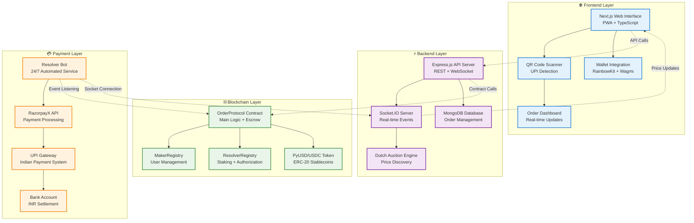
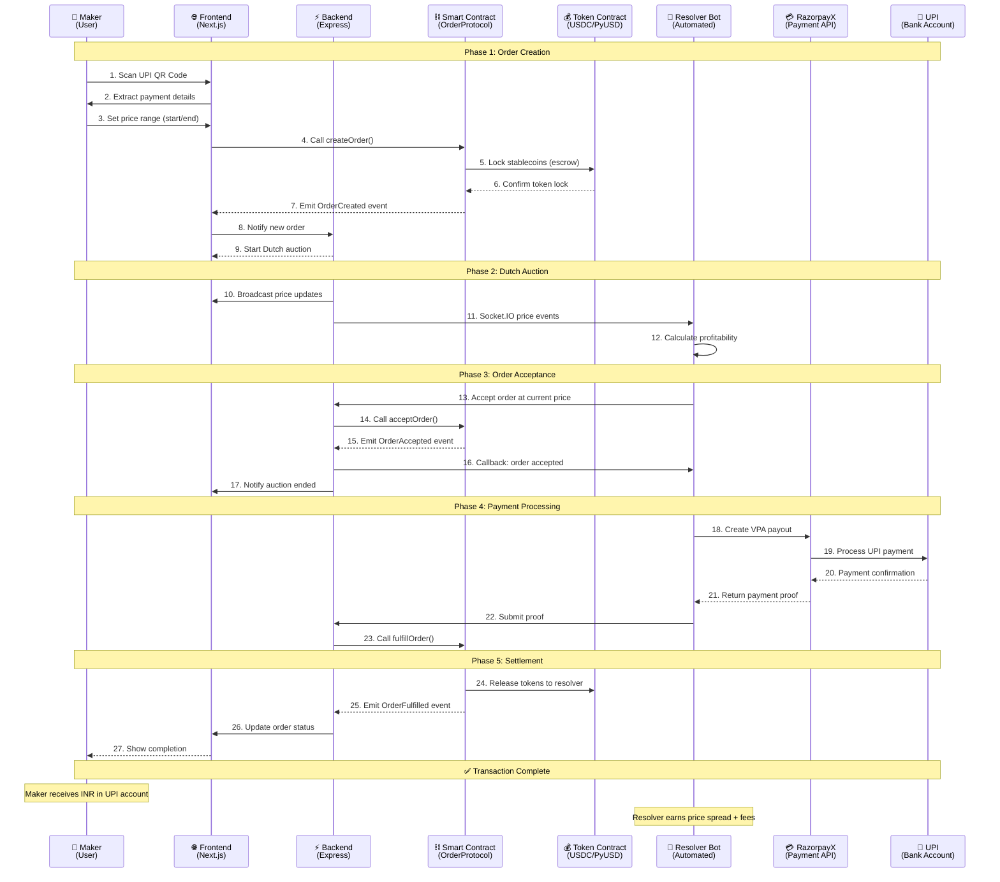
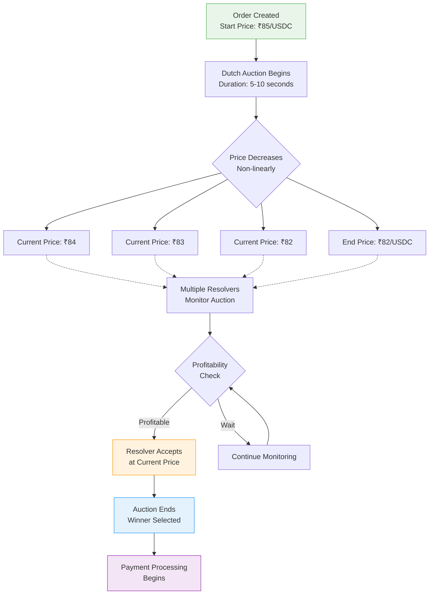

# ETH-FLOW BridgeOf PyUSD

## 🌉 Overview

**ETH-FLOW BridgeOf PyUSD** is a decentralized bridge protocol that enables seamless conversion from blockchain stablecoins (USDC/USDT/PyUSD) to Indian Rupees (INR) using UPI (Unified Payments Interface). The protocol employs a Dutch auction mechanism to facilitate fair pricing and automated settlement through a network of authorized resolvers.

### 🚀 Key Features

- **🏦 Blockchain to UPI Bridge**: Convert crypto stablecoins directly to INR via UPI payments
- **⚖️ Dutch Auction Pricing**: Fair market-driven price discovery mechanism
- **🤖 Automated Settlement**: Resolver bots handle payments automatically using RazorpayX
- **📱 Mobile-First UI**: PWA-enabled interface with QR code scanning
- **🔐 Trustless Architecture**: Smart contract-based escrow and settlement
- **💸 Low Fees**: Competitive resolver fees with transparent pricing
- **🌐 Multi-Network**: Deployed on Arbitrum Sepolia and Flow EVM Testnet

## 🏗️ System Architecture

### High-Level Architecture


## 🔄 Complete Process Flow

### Detailed Transaction Flow


## 🎯 Dutch Auction Mechanism

### Price Discovery Process


## 💰 How It Works

### 1. **Order Creation** 
- Makers scan UPI QR codes or manually enter payment details
- Smart contract locks stablecoins (USDC/PyUSD) as collateral
- Dutch auction is initiated with start/end price range

### 2. **Dutch Auction Process**
- Price decreases from start price to end price over time
- Multiple resolvers compete to accept orders at favorable prices
- First resolver to accept wins the order

### 3. **Payment Settlement**
- Winning resolver processes UPI payment via RazorpayX
- Payment proof is submitted to the smart contract
- Stablecoins are released to the resolver upon successful payment

### 4. **Order Fulfillment**
- Maker receives INR in their UPI account
- Resolver earns the difference between accepted price and actual payment
- Transaction is completed and recorded on-chain

## 🛠️ Tech Stack

### **Frontend**
- **Framework**: Next.js 15 with TypeScript
- **Web3 Integration**: Wagmi + RainbowKit
- **UI Components**: Radix UI + Tailwind CSS
- **QR Scanning**: @yudiel/react-qr-scanner
- **Real-time Updates**: Socket.IO Client
- **Charts**: Chart.js + React Chart.js 2
- **PWA Support**: next-pwa

### **Backend**
- **Runtime**: Node.js with Express.js
- **Database**: MongoDB with Mongoose
- **Real-time Communication**: Socket.IO
- **Security**: Helmet, CORS, Rate Limiting
- **Dutch Auction Engine**: Custom implementation

### **Smart Contracts**
- **Framework**: Foundry (Solidity ^0.8.20)
- **Standards**: OpenZeppelin contracts
- **Networks**: Arbitrum Sepolia, Flow EVM Testnet
- **Token Support**: USDC, PyUSD, MockUSDC

### **Resolver Bot**
- **Runtime**: Node.js with Express
- **Blockchain Interaction**: ethers.js v6
- **Payment Processing**: RazorpayX API
- **Logging**: Winston
- **Real-time Events**: Socket.IO Client

### **Infrastructure**
- **Containerization**: Docker + Docker Compose
- **Testing**: Foundry Test Suite
- **Deployment**: Manual deployment with verification
- **Monitoring**: Comprehensive logging system

## 🚦 Getting Started

### Prerequisites
- Node.js 18+ and npm/yarn
- Docker and Docker Compose
- Foundry for smart contract development
- RazorpayX API credentials
- Web3 wallet (MetaMask recommended)

### 📦 Installation

1. **Clone the repository**
```bash
git clone https://github.com/yug49/ETH-FLOW-BridgeOf-PyUSD.git
cd ETH-FLOW-BridgeOf-PyUSD
```

2. **Install dependencies for all components**
```bash
# Frontend
cd frontend
npm install
cd ..

# Backend
cd backend
npm install
cd ..

# Resolver Bot
cd resolver-bot
npm install
cd ..

# Smart Contracts (if not already installed)
forge install
```

3. **Environment Configuration**

Create `.env` files in each component directory:

**Root `.env`:**
```env
# Blockchain Configuration
RPC_URL=https://sepolia-rollup.arbitrum.io/rpc
PRIVATE_KEY=your_private_key_here
CONTRACT_ADDRESS=0xB39F0F6eD29B4502c199171E2d483fCe05E0f5b2
USDC_CONTRACT_ADDRESS=0x637A1259C6afd7E3AdF63993cA7E58BB438aB1B1

# API Configuration
BACKEND_URL=http://localhost:5001
FRONTEND_URL=http://localhost:3000

# Database
MONGODB_URI=mongodb://localhost:27017/orderprotocol

# RazorpayX Configuration
RAZORPAYX_KEY_ID=your_razorpayx_key_id
RAZORPAYX_KEY_SECRET=your_razorpayx_key_secret
RAZORPAYX_ACCOUNT_NUMBER=your_account_number
```

**Frontend `.env.local`:**
```env
NEXT_PUBLIC_BACKEND_URL=http://localhost:5001
NEXT_PUBLIC_CONTRACT_ADDRESS=0xB39F0F6eD29B4502c199171E2d483fCe05E0f5b2
NEXT_PUBLIC_CHAIN_ID=421614
```

**Backend `.env`:**
```env
PORT=5001
MONGODB_URI=mongodb://localhost:27017/orderprotocol
FRONTEND_URL=http://localhost:3000
NODE_ENV=development
```

**Resolver Bot `.env`:**
```env
PRIVATE_KEY=your_resolver_private_key
RPC_URL=https://sepolia-rollup.arbitrum.io/rpc
CONTRACT_ADDRESS=0xB39F0F6eD29B4502c199171E2d483fCe05E0f5b2
BACKEND_URL=http://localhost:5001
RAZORPAYX_KEY_ID=your_razorpayx_key_id
RAZORPAYX_KEY_SECRET=your_razorpayx_key_secret
RAZORPAYX_ACCOUNT_NUMBER=your_account_number
RESOLVER_CALLBACK_PORT=3001
LOG_LEVEL=info
```

### 🚀 Running the Application

#### Option 1: Docker Compose (Recommended)
```bash
# Start all services
docker-compose up -d

# View logs
docker-compose logs -f
```

#### Option 2: Manual Setup
```bash
# Terminal 1: Backend
cd backend
npm run dev

# Terminal 2: Frontend
cd frontend
npm run dev

# Terminal 3: Resolver Bot
cd resolver-bot
npm run dev

# Terminal 4: MongoDB (if running locally)
mongod
```

### 📱 Accessing the Application
- **Frontend**: http://localhost:3000
- **Backend API**: http://localhost:5001
- **API Health Check**: http://localhost:5001/health
- **Resolver Bot Callback**: http://localhost:3001/health

## 🎯 How to Use

### For Makers (Converting Crypto to INR)

1. **Connect Wallet**
   - Visit the web interface
   - Connect your Web3 wallet (MetaMask recommended)
   - Ensure you have USDC/PyUSD tokens

2. **Create Order**
   - Scan a UPI QR code or enter payment details manually
   - Set your preferred price range (start price > end price)
   - Confirm transaction to lock your stablecoins

3. **Monitor Auction**
   - Watch the Dutch auction progress in real-time
   - Price decreases over time until a resolver accepts

4. **Receive Payment**
   - Once accepted, resolver processes UPI payment
   - You receive INR in your specified UPI account
   - Transaction completes automatically

### For Resolvers (Processing Payments)

1. **Registration**
   - Stake 10 USDC as collateral in ResolverRegistry
   - Get approved by the protocol admin
   - Set up resolver bot with RazorpayX credentials

2. **Run Resolver Bot**
   - Configure environment variables
   - Start the resolver bot: `npm start`
   - Bot monitors Dutch auctions automatically

3. **Earn Fees**
   - Bot accepts profitable orders automatically
   - Processes UPI payments via RazorpayX
   - Earns spread between acceptance price and order amount

### For Developers

1. **Smart Contract Interaction**
```solidity
// Example: Create an order
orderProtocol.createOrder(
    1000 * 1e18,  // 1000 INR amount
    85 * 1e18,    // 85 INR per USDC start price
    82 * 1e18,    // 82 INR per USDC end price
    "recipient@upi"
);
```

2. **API Integration**
```javascript
// Example: Accept an order
const response = await fetch('/api/orders/ORDER_ID/accept', {
    method: 'POST',
    body: JSON.stringify({
        acceptedPrice: '83500000000000000000',
        resolverAddress: '0x...'
    })
});
```

## 📁 Project Structure

```
ETH-FLOW-BridgeOf-PyUSD/
├── frontend/                 # Next.js frontend application
│   ├── src/
│   │   ├── app/             # App router pages
│   │   ├── components/      # React components
│   │   └── lib/             # Utility libraries
│   └── package.json
├── backend/                  # Express.js backend API
│   ├── routes/              # API route handlers
│   ├── models/              # Database models
│   ├── server.js            # Main server file
│   └── package.json
├── resolver-bot/             # Automated resolver bot
│   ├── index.js             # Main bot logic
│   ├── abi/                 # Contract ABIs
│   └── package.json
├── src/                      # Smart contracts
│   ├── OrderProtocol.sol    # Main protocol contract
│   ├── MakerRegistry.sol    # Maker management
│   ├── ResolverRegistry.sol # Resolver management
│   └── interface/           # Contract interfaces
├── test/                     # Contract tests
├── script/                   # Deployment scripts
├── docker-compose.yml        # Docker configuration
├── foundry.toml             # Foundry configuration
└── Deployments.md           # Contract addresses
```

## 🔧 Smart Contract Details

### OrderProtocol Contract
**Address**: `0xB39F0F6eD29B4502c199171E2d483fCe05E0f5b2` (Arbitrum Sepolia)

**Key Functions:**
- `createOrder()`: Create a new payment order
- `acceptOrder()`: Accept an order during Dutch auction
- `fullfillOrder()`: Complete order with payment proof
- `getOrder()`: Retrieve order details

### MakerRegistry Contract
**Address**: `0x40F05c21eE1ab02B1Ddc11D327253CEdeE5D7D55`

**Purpose**: Manages authorized makers and their UPI details

### ResolverRegistry Contract
**Address**: `0xAC49Bd1e5877EAB0529cB9E3beaAAAF3dF67DE9f`

**Purpose**: Manages resolver staking and authorization

## 🧪 Testing

### Smart Contract Tests
```bash
# Run all tests
forge test

# Run specific test with verbosity
forge test --match-contract OrderProtocolTest -vv

# Generate coverage report
forge coverage
```

### Integration Tests
```bash
# Backend API tests
cd backend
npm test

# Frontend component tests
cd frontend
npm test

# Resolver bot tests
cd resolver-bot
npm run test
```

## 🌐 Deployment

### Smart Contracts
Contracts are deployed on:
- **Arbitrum Sepolia Testnet**
- **Flow EVM Testnet**

### Deployment Commands
```bash
# Deploy to Arbitrum Sepolia
forge create --rpc-url $ARB_SEPOLIA_RPC_URL \
    --private-key $PRIVATE_KEY \
    src/OrderProtocol.sol:OrderProtocol \
    --constructor-args $CONSTRUCTOR_ARGS \
    --verify

# Deploy to Flow EVM
forge create --rpc-url $FLOW_EVM_RPC_URL \
    --private-key $PRIVATE_KEY \
    src/OrderProtocol.sol:OrderProtocol \
    --constructor-args $CONSTRUCTOR_ARGS
```

## 🛡️ Security Considerations

### Smart Contract Security
- **Reentrancy Protection**: OpenZeppelin's security patterns
- **Access Controls**: Role-based permissions
- **Input Validation**: Comprehensive parameter checking
- **Time-based Controls**: Order expiration and fulfillment timeouts

### API Security
- **Rate Limiting**: Protection against abuse
- **CORS Configuration**: Restricted origin access
- **Input Sanitization**: SQL injection prevention
- **Authentication**: Wallet-based verification

### Payment Security
- **RazorpayX Integration**: Bank-grade security
- **Transaction Verification**: Proof-based settlement
- **Escrow Mechanism**: Smart contract holds funds
- **Dispute Resolution**: Admin intervention capability

## 🚨 Known Issues & Limitations

1. **Testnet Only**: Currently deployed on testnets only
2. **Manual Resolver Approval**: Requires admin approval for new resolvers
3. **INR Price Feed**: Uses fixed conversion rates (to be replaced with oracles)
4. **RazorpayX Dependency**: Relies on centralized payment processor
5. **Gas Costs**: Transaction fees on Arbitrum network

## 🔮 Future Enhancements

- [ ] **Mainnet Deployment**: Production deployment on Arbitrum One
- [ ] **Oracle Integration**: Real-time INR/USD price feeds
- [ ] **Multi-Currency Support**: EUR, GBP, and other fiat currencies
- [ ] **Mobile App**: Native iOS/Android applications
- [ ] **Advanced Analytics**: Detailed transaction reporting
- [ ] **Governance Token**: Decentralized protocol governance
- [ ] **Cross-chain Bridge**: Support for Ethereum, Polygon, etc.

## 🤝 Contributing

We welcome contributions! Please follow these steps:

1. Fork the repository
2. Create a feature branch: `git checkout -b feature/amazing-feature`
3. Commit changes: `git commit -m 'Add amazing feature'`
4. Push to branch: `git push origin feature/amazing-feature`
5. Open a Pull Request

## 📄 License

This project is licensed under the MIT License. See [LICENSE](LICENSE) file for details.

## 📞 Support & Contact

- **Developer**: Yug Agarwal
- **GitHub**: [@yug49](https://github.com/yug49)
- **Project Repository**: [ETH-FLOW-BridgeOf-PyUSD](https://github.com/yug49/ETH-FLOW-BridgeOf-PyUSD)

## 🏆 Acknowledgments

Built for hackathons and decentralized finance innovation. Special thanks to:
- Flow blockchain for EVM compatibility
- Arbitrum for scaling solutions  
- RazorpayX for payment infrastructure
- OpenZeppelin for security standards

---

**⚡ Ready to bridge the gap between crypto and traditional payments? Get started today!**