# ETH-FLOW BridgeOf PyUSD

## 🌉 Overview

**ETH-FLOW BridgeOf PyUSD** is a decentralized bridge protocol that enables seamless conversion from blockchain stablecoins (USDC/USDT/PyUSD) to Indian Rupees (INR) using UPI (Unified Payments Interface). The protocol employs a Dutch auction mechanism to facilitate fair pricing and automated settlement through a network of authorized resolvers.

### 🚀 Key Features

- **🏦 Blockchain to UPI Bridge**: Convert crypto stablecoins directly to INR via UPI payments
- **⚖️ Dutch Auction Pricing**: Fair market-driven price discovery mechanism
- **🤖 Automated Settlement**: Resolver bots handle payments automatically using RazorpayX
- **📱 Mobile-First UI**: PWA-enabled interface with QR code scanning
- **🔐 Trustless Architecture**: Smart contract-based escrow and settlement
- **💸 Low Fees**: Competitive resolver fees with transparent pricing
- **🌐 Multi-Network**: Deployed on Arbitrum Sepolia and Flow EVM Testnet

## � Tracks Targeted

## FLOW 

### 1️⃣ Best Killer App on Flow ($6,000)

**Goal of the Track**: Build a consumer-oriented app on Flow that demonstrates mass adoption potential, usability, and a seamless user experience.

**Integration in this project**:

**Flow EVM Testnet Deployment**:
The README explicitly mentions that the smart contracts are deployed on Flow EVM Testnet (OrderProtocol.sol). This satisfies the requirement of running transactions on Flow.

**Consumer-Facing UX**:
- Frontend is PWA-enabled with QR scanning for UPI payments.
- Makers can easily create orders, monitor Dutch auctions in real-time, and receive INR in their accounts.
- The mobile-first interface makes the experience seamless and intuitive, targeting mass adoption.

**Practical Use Case**:
By enabling conversion of USDC/PyUSD → INR via UPI, the project directly addresses a real-world payment problem for consumers in India. This aligns with the "killer app" criteria of providing significant utility to everyday users.

**Summary**:
The Flow track is integrated via smart contract deployment on Flow, combined with a mobile-first frontend that allows consumers to use PYUSD/USDC to get INR instantly. The project demonstrates real-world, user-friendly payment solutions leveraging Flow's blockchain capabilities.

## Fluence

### 2️⃣ Best Use of Fluence Virtual Servers ($5,000)

**Goal of the Track**: Demonstrate a working project using CPU-only VMs from Fluence for AI applications or backend services that are efficient and deployable without GPUs.

**Integration in this project**:

**Backend and Resolver Bot Deployment**:
The project is designed with a Node.js backend (backend/) and a resolver bot (resolver-bot/) that can run in lightweight server environments. Both components can easily run on CPU-only VMs, which aligns with the Fluence requirement.

- Backend handles API requests, Dutch auction logic, and database operations.
- Resolver bot monitors auctions and interacts with RazorpayX to process UPI payments.

**Dockerization**:
The project provides a docker-compose.yml for containerized deployment of frontend, backend, and resolver bot. This ensures easy setup on Fluence virtual servers without GPU dependencies.

**Automated Settlement Logic**:
The resolver bot implements automated payment processing, making this project a CPU-efficient real-time service. It can run inference or monitoring tasks for auction orders efficiently on small VMs, demonstrating "impactful use" of virtual server resources.

**Summary**:
The Fluence prize track is addressed by deploying the backend, resolver bot, and possibly the smart contract interaction scripts on Fluence CPU-only VMs, showing efficient server-side operations and live transaction processing without relying on GPUs.

## Paypal

### 3️⃣ 🥇 Grand Prize (Best Overall Transformative Use of PYUSD) — $4,500

**Goal of the Track**:
Awarded to the project that demonstrates a powerful and scalable real-world use case for PYUSD, setting a new benchmark in digital payments. It should highlight how PYUSD unlocks unique value—whether via remittances, commerce, or new economic opportunities.

**Integration in this project**:

**Blockchain-to-UPI Payments at Scale**:
Our project enables direct conversion of PYUSD into Indian Rupees (INR) through UPI, India's most widely used payment system. This bridges the gap between blockchain payments and traditional finance, allowing real-world spending of PYUSD without intermediaries.

- **Dutch Auction Mechanism**: Ensures fair, market-driven exchange rates for converting PYUSD → INR.
- **Trustless Settlement**: Smart contracts hold PYUSD in escrow, ensuring transparent and secure execution.
- **Global Accessibility**: Anyone holding PYUSD can now pay or remit funds into India seamlessly, unlocking cross-border commerce and remittance flows.

**Automated Resolver Network**:
A network of resolvers competes to settle payments using RazorpayX. This model ensures scalability, fair pricing, and faster settlements—showcasing how PYUSD can power decentralized payment infrastructure.

**Summary**:
The project demonstrates a transformative, real-world use case for PYUSD by connecting it to one of the largest real-time retail payment systems (UPI). This sets a new benchmark for digital stablecoin utility in developing markets.

### PYUSD Consumer Champion (Best Consumer-Focused Payments Experience) — $3,500

**Goal of the Track**:
Recognize the project that builds the most seamless and engaging consumer payment experience with PYUSD, especially for real-world microtransactions, cross-border settlements, or programmable subscriptions.

**Integration in this project**:

**Seamless User Flow for Consumers**:
- **Mobile-first PWA**: The frontend is designed as a Progressive Web App (PWA) so users can access it from mobile devices without installing an app.
- **QR Code Payments**: Makers simply scan or upload UPI QR codes, reducing friction in onboarding and payment flows.
- **Instant INR Credit**: Consumers receive INR directly into their UPI-linked bank account, making PYUSD practically usable for daily payments.

**Real-time Updates & UX**:
- **Socket.IO integration** gives consumers real-time auction updates, improving transparency and trust.
- **Clear Pricing with Auctions**: The Dutch auction format ensures users always get a fair and transparent exchange rate, enhancing confidence in using PYUSD for payments.

**Summary**:
By creating a consumer-first payment journey—from wallet connection to INR settlement—the project shows how PYUSD can become mainstream in everyday transactions in India, a market with 300M+ UPI users.

### PYUSD Possibilities Prize (Most Innovative Use Case of PYUSD) — $2,000

**Goal of the Track**:
Celebrate projects that think outside the wallet and apply PYUSD in unexpected but impactful ways—whether in gaming, education, social, or financial apps.

**Integration in this project**:

**Novel Dutch Auction Settlement for Stablecoin → Fiat Conversion**:
Instead of fixed rates or centralized exchanges, we designed a Dutch auction engine for pricing PYUSD conversions. This mechanism is rarely applied in stablecoin-to-fiat transfers and ensures decentralized, transparent price discovery.

**Decentralized Resolver Network**:
The project introduces the idea of resolver bots—independent entities that compete to process UPI payments using PYUSD escrow. This creates a new market-driven ecosystem of payment processors, incentivized through resolver fees.

**Cross-Network & Composability**:
- Deployed on Arbitrum Sepolia and Flow EVM Testnet.
- Open-source smart contracts allow developers to extend and build new payment modules on top of our system (e.g., subscriptions, payroll, or remittance services).

**Summary**:
The project's auction-based settlement + decentralized resolver model is a completely new way of using PYUSD in payments. It highlights an innovative design space for programmable money—unlocking potential beyond simple transfers.

## �🏗️ System Architecture

### High-Level Architecture

```mermaid
graph TB
    subgraph "🌐 Frontend Layer"
        A[Next.js Web Interface<br/>PWA + TypeScript]
        B[QR Code Scanner<br/>UPI Detection]
        C[Order Dashboard<br/>Real-time Updates]
        D[Wallet Integration<br/>RainbowKit + Wagmi]
        
        A --> B
        B --> C
        A --> D
    end
    
    subgraph "⚡ Backend Layer"
        E[Express.js API Server<br/>REST + WebSocket]
        F[Socket.IO Server<br/>Real-time Events]
        G[Dutch Auction Engine<br/>Price Discovery]
        H[MongoDB Database<br/>Order Management]
        
        E --> F
        F --> G
        E --> H
    end
    
    subgraph "⛓️ Blockchain Layer"
        I[OrderProtocol Contract<br/>Main Logic + Escrow]
        J[MakerRegistry<br/>User Management]
        K[ResolverRegistry<br/>Staking + Authorization]
        L[PyUSD/USDC Token<br/>ERC-20 Stablecoins]
        
        I --> J
        I --> K
        I --> L
    end
    
    subgraph "💳 Payment Layer"
        M[Resolver Bot<br/>24/7 Automated Service]
        N[RazorpayX API<br/>Payment Processing]
        O[UPI Gateway<br/>Indian Payment System]
        P[Bank Account<br/>INR Settlement]
        
        M --> N
        N --> O
        O --> P
    end
    
    %% Connections between layers
    A -.->|API Calls| E
    E -.->|Contract Calls| I
    M -.->|Event Listening| I
    M -.->|Socket Connection| F
    F -.->|Price Updates| A
    
    %% Styling
    classDef frontend fill:#e3f2fd,stroke:#1976d2,stroke-width:2px
    classDef backend fill:#f3e5f5,stroke:#7b1fa2,stroke-width:2px
    classDef blockchain fill:#e8f5e8,stroke:#388e3c,stroke-width:2px
    classDef payment fill:#fff3e0,stroke:#f57c00,stroke-width:2px
    
    class A,B,C,D frontend
    class E,F,G,H backend
    class I,J,K,L blockchain
    class M,N,O,P payment
```


## 🔄 Complete Process Flow

### Detailed Transaction Flow

```mermaid
sequenceDiagram
    participant Maker as 👤 Maker<br/>(User)
    participant Frontend as 🌐 Frontend<br/>(Next.js)
    participant Backend as ⚡ Backend<br/>(Express)
    participant Contract as ⛓️ Smart Contract<br/>(OrderProtocol)
    participant Token as 💰 Token Contract<br/>(USDC/PyUSD)
    participant Bot as 🤖 Resolver Bot<br/>(Automated)
    participant RazorPay as 💳 RazorpayX<br/>(Payment API)
    participant UPI as 🏦 UPI<br/>(Bank Account)
    
    Note over Maker,UPI: Phase 1: Order Creation
    Maker->>Frontend: 1. Scan UPI QR Code
    Frontend->>Maker: 2. Extract payment details
    Maker->>Frontend: 3. Set price range (start/end)
    Frontend->>Contract: 4. Call createOrder()
    Contract->>Token: 5. Lock stablecoins (escrow)
    Token-->>Contract: 6. Confirm token lock
    Contract-->>Frontend: 7. Emit OrderCreated event
    Frontend->>Backend: 8. Notify new order
    Backend-->>Frontend: 9. Start Dutch auction
    
    Note over Maker,UPI: Phase 2: Dutch Auction
    Backend->>Frontend: 10. Broadcast price updates
    Backend->>Bot: 11. Socket.IO price events
    Bot->>Bot: 12. Calculate profitability
    
    Note over Maker,UPI: Phase 3: Order Acceptance
    Bot->>Backend: 13. Accept order at current price
    Backend->>Contract: 14. Call acceptOrder()
    Contract-->>Backend: 15. Emit OrderAccepted event
    Backend->>Bot: 16. Callback: order accepted
    Backend->>Frontend: 17. Notify auction ended
    
    Note over Maker,UPI: Phase 4: Payment Processing
    Bot->>RazorPay: 18. Create VPA payout
    RazorPay->>UPI: 19. Process UPI payment
    UPI-->>RazorPay: 20. Payment confirmation
    RazorPay-->>Bot: 21. Return payment proof
    Bot->>Backend: 22. Submit proof
    Backend->>Contract: 23. Call fulfillOrder()
    
    Note over Maker,UPI: Phase 5: Settlement
    Contract->>Token: 24. Release tokens to resolver
    Contract-->>Backend: 25. Emit OrderFulfilled event
    Backend->>Frontend: 26. Update order status
    Frontend-->>Maker: 27. Show completion
    
    Note over Maker,UPI: ✅ Transaction Complete
    Note over Maker: Maker receives INR in UPI account
    Note over Bot: Resolver earns price spread + fees
```


## 🎯 Dutch Auction Mechanism

### Price Discovery Process


## 💰 How It Works

### 1. **Order Creation** 
- Makers scan UPI QR codes or manually enter payment details
- Smart contract locks stablecoins (USDC/PyUSD) as collateral
- Dutch auction is initiated with start/end price range

### 2. **Dutch Auction Process**
- Price decreases from start price to end price over time
- Multiple resolvers compete to accept orders at favorable prices
- First resolver to accept wins the order

### 3. **Payment Settlement**
- Winning resolver processes UPI payment via RazorpayX
- Payment proof is submitted to the smart contract
- Stablecoins are released to the resolver upon successful payment

### 4. **Order Fulfillment**
- Maker receives INR in their UPI account
- Resolver earns the difference between accepted price and actual payment
- Transaction is completed and recorded on-chain

## 🛠️ Tech Stack

### **Frontend**
- **Framework**: Next.js 15 with TypeScript
- **Web3 Integration**: Wagmi + RainbowKit
- **UI Components**: Radix UI + Tailwind CSS
- **QR Scanning**: @yudiel/react-qr-scanner
- **Real-time Updates**: Socket.IO Client
- **Charts**: Chart.js + React Chart.js 2
- **PWA Support**: next-pwa

### **Backend**
- **Runtime**: Node.js with Express.js
- **Database**: MongoDB with Mongoose
- **Real-time Communication**: Socket.IO
- **Security**: Helmet, CORS, Rate Limiting
- **Dutch Auction Engine**: Custom implementation

### **Smart Contracts**
- **Framework**: Foundry (Solidity ^0.8.20)
- **Standards**: OpenZeppelin contracts
- **Networks**: Arbitrum Sepolia, Flow EVM Testnet
- **Token Support**: USDC, PyUSD, MockUSDC

### **Resolver Bot**
- **Runtime**: Node.js with Express
- **Blockchain Interaction**: ethers.js v6
- **Payment Processing**: RazorpayX API
- **Logging**: Winston
- **Real-time Events**: Socket.IO Client

### **Infrastructure**
- **Containerization**: Docker + Docker Compose
- **Testing**: Foundry Test Suite
- **Deployment**: Manual deployment with verification
- **Monitoring**: Comprehensive logging system

## 🚦 Getting Started

### Prerequisites
- Node.js 18+ and npm/yarn
- Docker and Docker Compose
- Foundry for smart contract development
- RazorpayX API credentials
- Web3 wallet (MetaMask recommended)

### 📦 Installation

1. **Clone the repository**
```bash
git clone https://github.com/yug49/ETH-FLOW-BridgeOf-PyUSD.git
cd ETH-FLOW-BridgeOf-PyUSD
```

2. **Install dependencies for all components**
```bash
# Frontend
cd frontend
npm install
cd ..

# Backend
cd backend
npm install
cd ..

# Resolver Bot
cd resolver-bot
npm install
cd ..

# Smart Contracts (if not already installed)
forge install
```

3. **Environment Configuration**

Create `.env` files in each component directory:

**Root `.env`:**
```env
# Blockchain Configuration
RPC_URL=https://sepolia-rollup.arbitrum.io/rpc
PRIVATE_KEY=your_private_key_here
CONTRACT_ADDRESS=0xB39F0F6eD29B4502c199171E2d483fCe05E0f5b2
USDC_CONTRACT_ADDRESS=0x637A1259C6afd7E3AdF63993cA7E58BB438aB1B1

# API Configuration
BACKEND_URL=http://localhost:5001
FRONTEND_URL=http://localhost:3000

# Database
MONGODB_URI=mongodb://localhost:27017/orderprotocol

# RazorpayX Configuration
RAZORPAYX_KEY_ID=your_razorpayx_key_id
RAZORPAYX_KEY_SECRET=your_razorpayx_key_secret
RAZORPAYX_ACCOUNT_NUMBER=your_account_number
```

**Frontend `.env.local`:**
```env
NEXT_PUBLIC_BACKEND_URL=http://localhost:5001
NEXT_PUBLIC_CONTRACT_ADDRESS=0xB39F0F6eD29B4502c199171E2d483fCe05E0f5b2
NEXT_PUBLIC_CHAIN_ID=421614
```

**Backend `.env`:**
```env
PORT=5001
MONGODB_URI=mongodb://localhost:27017/orderprotocol
FRONTEND_URL=http://localhost:3000
NODE_ENV=development
```

**Resolver Bot `.env`:**
```env
PRIVATE_KEY=your_resolver_private_key
RPC_URL=https://sepolia-rollup.arbitrum.io/rpc
CONTRACT_ADDRESS=0xB39F0F6eD29B4502c199171E2d483fCe05E0f5b2
BACKEND_URL=http://localhost:5001
RAZORPAYX_KEY_ID=your_razorpayx_key_id
RAZORPAYX_KEY_SECRET=your_razorpayx_key_secret
RAZORPAYX_ACCOUNT_NUMBER=your_account_number
RESOLVER_CALLBACK_PORT=3001
LOG_LEVEL=info
```

### 🚀 Running the Application

#### Option 1: Docker Compose (Recommended)
```bash
# Start all services
docker-compose up -d

# View logs
docker-compose logs -f
```

#### Option 2: Manual Setup
```bash
# Terminal 1: Backend
cd backend
npm run dev

# Terminal 2: Frontend
cd frontend
npm run dev

# Terminal 3: Resolver Bot
cd resolver-bot
npm run dev

# Terminal 4: MongoDB (if running locally)
mongod
```

### 📱 Accessing the Application
- **Frontend**: http://localhost:3000
- **Backend API**: http://localhost:5001
- **API Health Check**: http://localhost:5001/health
- **Resolver Bot Callback**: http://localhost:3001/health

## 🎯 How to Use

### For Makers (Converting Crypto to INR)

1. **Connect Wallet**
   - Visit the web interface
   - Connect your Web3 wallet (MetaMask recommended)
   - Ensure you have USDC/PyUSD tokens

2. **Create Order**
   - Scan a UPI QR code or enter payment details manually
   - Set your preferred price range (start price > end price)
   - Confirm transaction to lock your stablecoins

3. **Monitor Auction**
   - Watch the Dutch auction progress in real-time
   - Price decreases over time until a resolver accepts

4. **Receive Payment**
   - Once accepted, resolver processes UPI payment
   - You receive INR in your specified UPI account
   - Transaction completes automatically

### For Resolvers (Processing Payments)

1. **Registration**
   - Stake 10 USDC as collateral in ResolverRegistry
   - Get approved by the protocol admin
   - Set up resolver bot with RazorpayX credentials

2. **Run Resolver Bot**
   - Configure environment variables
   - Start the resolver bot: `npm start`
   - Bot monitors Dutch auctions automatically

3. **Earn Fees**
   - Bot accepts profitable orders automatically
   - Processes UPI payments via RazorpayX
   - Earns spread between acceptance price and order amount

### For Developers

1. **Smart Contract Interaction**
```solidity
// Example: Create an order
orderProtocol.createOrder(
    1000 * 1e18,  // 1000 INR amount
    85 * 1e18,    // 85 INR per USDC start price
    82 * 1e18,    // 82 INR per USDC end price
    "recipient@upi"
);
```

2. **API Integration**
```javascript
// Example: Accept an order
const response = await fetch('/api/orders/ORDER_ID/accept', {
    method: 'POST',
    body: JSON.stringify({
        acceptedPrice: '83500000000000000000',
        resolverAddress: '0x...'
    })
});
```

## 📁 Project Structure

```
ETH-FLOW-BridgeOf-PyUSD/
├── frontend/                 # Next.js frontend application
│   ├── src/
│   │   ├── app/             # App router pages
│   │   ├── components/      # React components
│   │   └── lib/             # Utility libraries
│   └── package.json
├── backend/                  # Express.js backend API
│   ├── routes/              # API route handlers
│   ├── models/              # Database models
│   ├── server.js            # Main server file
│   └── package.json
├── resolver-bot/             # Automated resolver bot
│   ├── index.js             # Main bot logic
│   ├── abi/                 # Contract ABIs
│   └── package.json
├── src/                      # Smart contracts
│   ├── OrderProtocol.sol    # Main protocol contract
│   ├── MakerRegistry.sol    # Maker management
│   ├── ResolverRegistry.sol # Resolver management
│   └── interface/           # Contract interfaces
├── test/                     # Contract tests
├── script/                   # Deployment scripts
├── docker-compose.yml        # Docker configuration
├── foundry.toml             # Foundry configuration
└── Deployments.md           # Contract addresses
```

## 🔧 Smart Contract Details

### OrderProtocol Contract
**Address**: `0xB39F0F6eD29B4502c199171E2d483fCe05E0f5b2` (Arbitrum Sepolia)

**Key Functions:**
- `createOrder()`: Create a new payment order
- `acceptOrder()`: Accept an order during Dutch auction
- `fullfillOrder()`: Complete order with payment proof
- `getOrder()`: Retrieve order details

### MakerRegistry Contract
**Address**: `0x40F05c21eE1ab02B1Ddc11D327253CEdeE5D7D55`

**Purpose**: Manages authorized makers and their UPI details

### ResolverRegistry Contract
**Address**: `0xAC49Bd1e5877EAB0529cB9E3beaAAAF3dF67DE9f`

**Purpose**: Manages resolver staking and authorization

## 🧪 Testing

### Smart Contract Tests
```bash
# Run all tests
forge test

# Run specific test with verbosity
forge test --match-contract OrderProtocolTest -vv

# Generate coverage report
forge coverage
```

### Integration Tests
```bash
# Backend API tests
cd backend
npm test

# Frontend component tests
cd frontend
npm test

# Resolver bot tests
cd resolver-bot
npm run test
```

## 🌐 Deployment

### Smart Contracts
Contracts are deployed on:
- **Arbitrum Sepolia Testnet**
- **Flow EVM Testnet**

### Deployment Commands
```bash
# Deploy to Arbitrum Sepolia
forge create --rpc-url $ARB_SEPOLIA_RPC_URL \
    --private-key $PRIVATE_KEY \
    src/OrderProtocol.sol:OrderProtocol \
    --constructor-args $CONSTRUCTOR_ARGS \
    --verify

# Deploy to Flow EVM
forge create --rpc-url $FLOW_EVM_RPC_URL \
    --private-key $PRIVATE_KEY \
    src/OrderProtocol.sol:OrderProtocol \
    --constructor-args $CONSTRUCTOR_ARGS
```

## 🛡️ Security Considerations

### Smart Contract Security
- **Reentrancy Protection**: OpenZeppelin's security patterns
- **Access Controls**: Role-based permissions
- **Input Validation**: Comprehensive parameter checking
- **Time-based Controls**: Order expiration and fulfillment timeouts

### API Security
- **Rate Limiting**: Protection against abuse
- **CORS Configuration**: Restricted origin access
- **Input Sanitization**: SQL injection prevention
- **Authentication**: Wallet-based verification

### Payment Security
- **RazorpayX Integration**: Bank-grade security
- **Transaction Verification**: Proof-based settlement
- **Escrow Mechanism**: Smart contract holds funds
- **Dispute Resolution**: Admin intervention capability

## 🚨 Known Issues & Limitations

1. **Testnet Only**: Currently deployed on testnets only
2. **Manual Resolver Approval**: Requires admin approval for new resolvers
3. **INR Price Feed**: Uses fixed conversion rates (to be replaced with oracles)
4. **RazorpayX Dependency**: Relies on centralized payment processor
5. **Gas Costs**: Transaction fees on Arbitrum network

## 🔮 Future Enhancements

- [ ] **Mainnet Deployment**: Production deployment on Arbitrum One
- [ ] **Oracle Integration**: Real-time INR/USD price feeds
- [ ] **Multi-Currency Support**: EUR, GBP, and other fiat currencies
- [ ] **Mobile App**: Native iOS/Android applications
- [ ] **Advanced Analytics**: Detailed transaction reporting
- [ ] **Governance Token**: Decentralized protocol governance
- [ ] **Cross-chain Bridge**: Support for Ethereum, Polygon, etc.

## 🤝 Contributing

We welcome contributions! Please follow these steps:

1. Fork the repository
2. Create a feature branch: `git checkout -b feature/amazing-feature`
3. Commit changes: `git commit -m 'Add amazing feature'`
4. Push to branch: `git push origin feature/amazing-feature`
5. Open a Pull Request

## 📄 License

This project is licensed under the MIT License. See [LICENSE](LICENSE) file for details.

## 📞 Support & Contact

- **Developer**: Yug Agarwal, Samkit Soni, Kaushtabh Agrawal
- **GitHub**: [@yug49](https://github.com/yug49)
- **Project Repository**: [PyPI](https://github.com/yug49/PyPI)

## 🏆 Acknowledgments

Built for hackathons and decentralized finance innovation. Special thanks to:
- Flow blockchain for EVM compatibility
- Arbitrum for scaling solutions  
- RazorpayX for payment infrastructure
- OpenZeppelin for security standards

---

**⚡ Ready to bridge the gap between crypto and traditional payments? Get started today!**